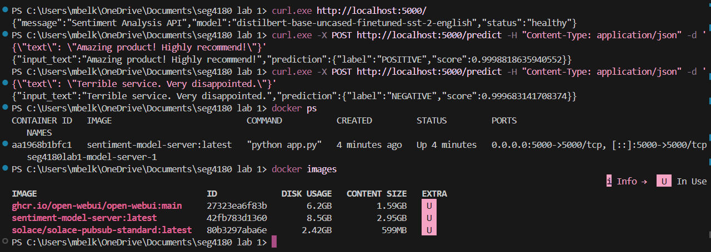
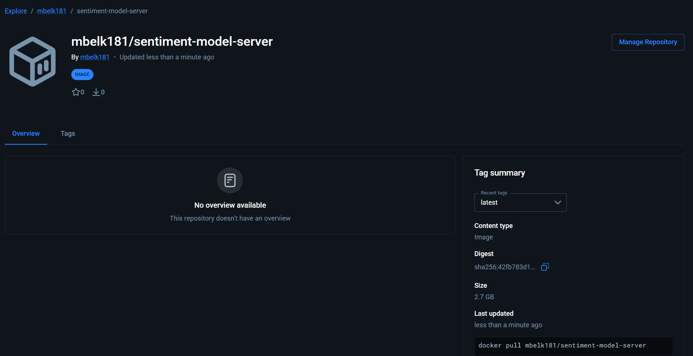

# Lab 1: ML Model Server - Sentiment Analysis

## Overview

Dockerized sentiment analysis API using DistilBERT from HuggingFace, served with Flask and Waitress.

## Screenshots




Docker Hub URL: https://hub.docker.com/r/mbelk181/sentiment-model-server

## Quick Start

### Build and Run

```bash
docker-compose up --build
```

### Test the API

```bash
# Health check
curl http://localhost:5000/

# Make prediction
curl -X POST http://localhost:5000/predict \
  -H "Content-Type: application/json" \
  -d '{"text": "I love this product!"}'
```

## Docker Hub Deployment

### Tag and Push

```bash
docker login
docker tag sentiment-model-server:latest YOUR_USERNAME/sentiment-model-server:latest
docker push YOUR_USERNAME/sentiment-model-server:latest
```

### Pull and Run

```bash
docker pull YOUR_USERNAME/sentiment-model-server:latest
docker run -p 5000:5000 YOUR_USERNAME/sentiment-model-server:latest
```

## API Endpoints

**GET /**

- Health check

**POST /predict**

- Input: `{"text": "your text here"}`
- Output: `{"input_text": "...", "prediction": {"label": "POSITIVE/NEGATIVE", "score": 0.99}}`

## Model

- **Model**: distilbert-base-uncased-finetuned-sst-2-english
- **Source**: HuggingFace Transformers
- **Task**: Sentiment Analysis
